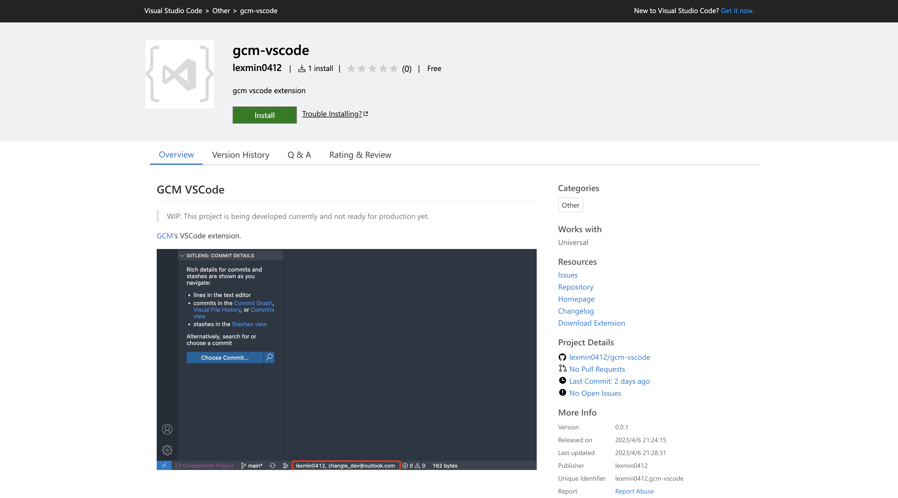
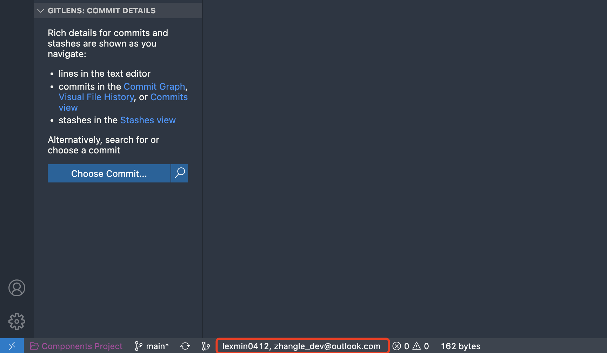

# GCM VSCode

<a href="https://github.com/lexmin0412/gcm">GCM</a>'s VSCode extension.

As a VSCode extension, `gcm-vscode` now has been published on marketplace, [click me](https://marketplace.visualstudio.com/items?itemName=lexmin0412.gcm-vscode) or type `lexmin0412.gcm-vscode` in search input in your VSCode's extension tab to install it.

Then click `Install` button and wait a second, your private git user config manager would be ready.

